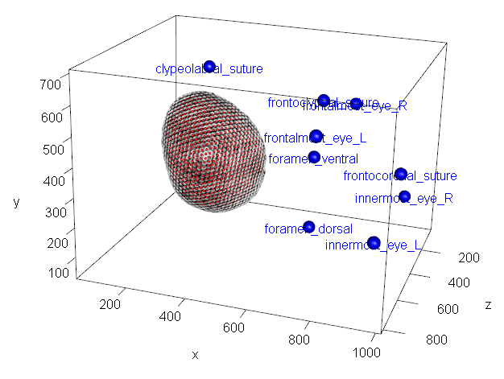

<!-- output: rmarkdown::html_vignette
-->
<!-- ```{r, include = FALSE} -->
<!-- knitr::opts_chunk$set( -->
<!--   collapse = TRUE, -->
<!--   comment = "#>" -->
<!-- ) -->
<!-- ``` -->


## Introduction
This documents illustrates the workflow of the CompoundVision3D package 
of Rühr et al. using a dataset of *Drosophila melanogaster* published in

Schoborg, T. A., Smith, S. L., Smith, L. N., Morris, H. D., & Rusan, N. M. (**2019**). Micro-computed tomography as a platform for exploring *Drosophila* development. *Development* **146**(23), dev176685. DOI: [10.1242/dev.176685](https://doi.org/10.1242/dev.176685).
  
## Code
### Load compoundvision3D package:
```{r setup1, warning=FALSE, message=FALSE}
library(compoundvision3D)
```
<!-- # ```{r setup_set_wd, include=FALSE, warning=FALSE, message=FALSE} -->
<!-- # setwd("X:/Pub/2019/Ruehr_compound_vision/compound_vision_3D/vignettes") -->
<!-- # ``` -->

### Load all other packages needed:
```{r setup2, warning=FALSE, message=FALSE}
# 3D plotting
library(rgl)

# load the whole tidyverse for its various conveniences
library(tidyverse)
```

### Define folder with example data
```{r define_folders, warning=FALSE, message=FALSE}
source_directory = "./data"

# create target folder if it does not yet exist
target_directory = "./data/results"
dir.create(target_directory)
```

### Convert STL with compound eye surface to a tibble
```{r define_STL_file, evaluate=TRUE, warning=FALSE, message=FALSE}
# define file list with STL files
file_list <- list.files(source_directory, pattern = ".stl", full.names = TRUE)
curr_filename <- file_list[1]
```

```{r import_STL, evaluate=FALSE, warning=FALSE, message=FALSE}
# Import first STL of file lust
tri_centers_normals <- STL_triangles(file_name = curr_filename, 
                                     plot_results = FALSE,
                                     verbose = FALSE)
```
The `tri_centers_normals` tibble of this example on *Drosophila* can also be loaded with
```{r load_tri_centers_normals, eval=TRUE, include=TRUE, warning=FALSE, message=FALSE}
tri_centers_normals <- compoundvision3D::tri_centers_normals
``` 

### Plot imported eye data
```{r plot_imported_eye, eval=FALSE, warning=FALSE, message=FALSE}
# plot imported eye data
plot3d(tri_centers_normals %>% 
         select(x,y,z),
       size = 2, 
       aspect = "iso")

# draw some random vectors on eye to see if they point in the right directions
vec.mult <- 100
for(curr_facet in round(seq(1, nrow(tri_centers_normals), length.out = 50))){ # nrow(curr_facets)
  normal_vectors_df_subset <- tri_centers_normals %>% 
    filter(ID == curr_facet) %>% 
    select(norm.x, norm.y, norm.z)
  curr_facet_coordinates <- tri_centers_normals %>% 
    filter(ID==curr_facet) %>% 
    select(x,y,z)
  
  # find mean point of normalized normal vector ends
  norm.x <- normal_vectors_df_subset$norm.x
  norm.y <- normal_vectors_df_subset$norm.y
  norm.z <- normal_vectors_df_subset$norm.z
  
  lines3d(x = c(curr_facet_coordinates %>% pull(x), 
                curr_facet_coordinates %>% pull(x) + norm.x*vec.mult),
          y = c(curr_facet_coordinates %>% pull(y), 
                curr_facet_coordinates %>% pull(y) + norm.y*vec.mult),
          z = c(curr_facet_coordinates %>% pull(z), 
                curr_facet_coordinates %>% pull(z) + norm.z*vec.mult),
          col = "red")
}
```
{width=6in}


### Manually define search diameter
```{r define_search_diameter, eval=FALSE, warning=FALSE, message=FALSE}
# manually select 2 neighboring facets to define search diameter
curr_search_diam <- search_diam_interactive(df = tri_centers_normals)

[1] "Rotate view so that two facet peaks are clearly identifyable."
Finished rotation? ("y" = yes; "n" = no")
[1] "Select the fist of two neighboring facet peaks. Then press the 'Esc' key."
[1] "Select the seceond of two neighboring facet peaks. Then press the 'Esc' key."
[1] "Facet diameter: ~12.72"
[1] "Search diameter: 38.158"
[1] "done!"
``` 
{width=6in}
```{r set_search_diameter, include=FALSE, warning=FALSE, message=FALSE}
# manually select 2 neighboring facets to define search diameter
curr_search_diam <- 38.158
```

### Find Local Heights: Calculate distances of vertices from local plane
```{r find_local_heights, eval=FALSE, warning=FALSE, message=FALSE}
# This is a multi-threaded but may still take a while. Define number of cores to suit your system (cores = n).
local_heights <- get_local_heights(df = tri_centers_normals,
                                   search_diam = curr_search_diam,
                                   cores = 12,
                                   verbose = TRUE)

[1] "Starting analyses on cluster..."
[1] "Calculating local heights for all 22464 vertices..."
[1] "Cluster analysis finished."
Time difference of 19.27364 secs
[1] "done!"
``` 
The `local_heights` tibble of this example on *Drosophila* can also be loaded with
```{r load_local_heights, eval=TRUE, include=TRUE, warning=FALSE, message=FALSE}
local_heights <- compoundvision3D::local_heights
``` 

### Plot distribution of local height values
```{r plot_local_heights_2D, eval=TRUE, warning=FALSE, message=FALSE, fig.width=6}
# calculate height colours for raw, filtered and log-transformed local heights
par(mfrow=c(1,3))
local_height_cols_raw <- get_height_colors(heights = local_heights$local_height)
plot(local_heights$local_height, col = local_height_cols_raw, pch=16, cex=.2,
     main = "raw")

local_height_cols_filtered <- get_height_colors(heights = local_heights$local_height,
                                                lower_quantile = 0.1,
                                                upper_quantile = 0.9)
plot(local_heights$local_height, col = local_height_cols_filtered, pch=16, cex=.2,
     main = "quantile")

local_height_cols_filtered_log <- get_height_colors(heights = 10^local_heights$local_height,
                                                    lower_quantile = 0.5,
                                                    upper_quantile = 0.9)
plot(local_heights$local_height, col = local_height_cols_filtered_log, pch=16, cex=.2,
     main = "quantile & log")
par(mfrow=c(1,1))
```

### Add colors according to local heights
```{r plot_add_local_height_cols, eval=TRUE, warning=FALSE, message=FALSE}
# add colour column for raw values
local_heights$local_height_col <- local_height_cols_raw

# add colour and value column for log values
local_heights$local_height_log <- 10^local_heights$local_height
local_heights$local_height_col_log <- local_height_cols_filtered_log
```


### Plot local heights 3D
```{r plot_local_heights_3D, eval=FALSE, warning=FALSE, message=FALSE}
# plot eye in 'SEM colors' with local height values
plot3d(local_heights %>% 
         select(x,y,z), 
       col = local_heights %>% 
         pull(local_height_col), 
       aspect = "iso",
       size=5)
title3d("local_height",
          col = 'black', line = 5)

# plot eye in 'SEM colors' with quantile-filtered log-transformed local height values
plot3d(local_heights %>% 
         select(x,y,z), 
       col = local_heights %>% 
         pull(local_height_col_log), 
       aspect = "iso",
       size=5)
title3d("local_height_log",
          col = 'black', line = 5)
```
{width=3in}
{width=3in}

<span style="font-size:.75em;">***Figure:** 3D Plot of *Drosophila *eye with raw local heights (**left**) and log-transformed, quantile-filtered local heights (**right**).*</span>

### Find height threshold before clustering
choose the raw values (`local_height`), or log-transformed, quantile-filtered values (`local_height_log`) 
for the automatic finding algorithm of facet positions. Usually, the latter are a better choice (s. Fig. above):

```{r define_height_column, eval=TRUE, warning=FALSE, message=FALSE}
height_column <- "local_height_log"
```

Now choose a good threshold separating vertices of each facet from the vertices of other facets. If the vertices of the 2D plot overlay each other, change the x and y axes of your plot by (out-)commenting the `column1` and `column2` lines:

```{r find_threshold, eval=FALSE, warning=FALSE, message=FALSE}
# find threshold manually
find_threshold(df = local_heights,
               column1 = "x",
               # column1 = "y",
               column2 = "y",
               # column2 = "z",
               height_column = height_column,
               min_threshold = 1,
               max_treshold = 2,
               trials = 12,
               plot_file = "./Drosophila_eye_thresholds.pdf")
```

{width=6in}

### Choose a good threshold from plot and filter local heights according to it
```{r define_threshold, eval=TRUE, warning=FALSE, message=FALSE}
# define threshold
curr_threshold = 1.27

# filter data according to threshold
rough_clusters <- local_heights %>% 
  filter(!!as.symbol(height_column) >= curr_threshold) %>% 
  select(x,y,z)
```

### Plot the positions of the thresholded vertices
```{r plot_threshold_3D, eval=FALSE, warning=FALSE, message=FALSE}
# plot eye in 'SEM colors'
plot3d(local_heights %>% 
         select(x,y,z), 
       col = local_heights %>% 
         pull(local_height_col_log), 
       aspect = "iso",
       size=4)

# add clusters to plot
spheres3d(rough_clusters, 
          col = "orange", 
          aspect = "iso",
          radius = curr_search_diam/20)
```

{width=6in}

### Find facets positions.
This needs quite a bit of user attention. 

Before running `find_facets_fine()`, make sure that your graphics device window is large.
```{r find_facets_fine, eval=FALSE, warning=FALSE, message=FALSE}
# get fine peaks. Make sure your plot device is as large as possible
facet_positions_auto <- find_facets_fine(df = rough_clusters,
                               cols_to_use = 1:3,
                               # h_min = 31.273,
                               # h_max = 5.219,
                               # h_final = 17.7691,
                               # n_steps = 100,
                               plot_file = "./Drosophila_eye_facets_auto.pdf")
```

``` 
Calculating distance matrix...
Calculating and plotting dendrogram of hierarchichal clustering...
select minimum and maximum cut-off points on y axis for first trial.
Only select two points, the script will continue automatically.
31.273; 5.219.
[1] "Min.: 31.273; max.: 5.219"
Finding clusters for 100 points between cut-off values.
select cut-off point on y axis.
[1] "Final cut-off chosen: 17.7690810052902"
[1] "Saving plots as ./Drosophila_eye_facets_auto.pdf"
[1] "Found 749 facet center candiates. Check 3D plot device."
Time difference of 20.89946 secs
Plotting 'SEM'-coloured eye in RGL 3D window. Check it out to get overview.
```
{width=6in}

<!-- {width=6in} -->

### Plot final result of automatic facet finding
```{r plot_faccets_auto_final, eval=FALSE, warning=FALSE, message=FALSE}
# get a rough estimate of facet size
curr_facet_size <- curr_search_diam/2

# plot eye in 3D to get overview
plot3d(local_heights %>% 
         select(x,y,z), 
       col = local_heights$local_height_col_log, 
       size= 5,
       aspect = "iso")

# plot the cluster centers
spheres3d(facet_positions_auto %>% 
            select(x, y, z), 
          col="red", radius=curr_facet_size, alpha = 1)
```

{width=6in}

### Manual facet position correction in Blender
XXX: describe the process with pics

### Import facet positions
```{r import_facets_positions, eval=FALSE, warning=FALSE, message=FALSE}
# load csv file with facet coordinates
facet_positions <- read_csv(curr_facets_positions_file,
                              show_col_types = FALSE)
```

The `facet_positions` tibble of this example on *Drosophila* can also be loaded with
```{r read_facet_positions, eval=TRUE, include=TRUE, warning=FALSE, message=FALSE}
facet_positions <- compoundvision3D::facet_positions

# show facet positions
print(facet_positions)
```

### Reference facet positions from Blender with local_heights data
Now we will find the closest points in local_heights for each facet position that was imported from Blender.

We are using half of the previously defined search diameter:

```{r reference_facets, eval=FALSE, warning=FALSE, message=FALSE}
# load csv file with facet coordinates
facet_positions_new <- reference_point_clouds(coordinates = facet_positions,
                         reference_coordinates = local_heights,
                         search_diameter = curr_search_diam/2,
                         cores = 12)
```

The `facet_positions_new` tibble of this example on *Drosophila* can also be loaded with
```{r load_referenced_facets, eval=TRUE, include=TRUE, warning=FALSE, message=FALSE}
facet_positions_new <- compoundvision3D::facet_positions_new

# show facet positions
print(facet_positions_new)
```

### Plot eye data with facets
Now we will plot the local height data of the eye and add its facet positions. These two point clouds should overlay each other correctly.

```{r plot_corrected_facets_on_eye, eval=FALSE, warning=FALSE, message=FALSE}
# plot eye in SEM colors
plot3d(local_heights %>% 
         select(x,y,z), 
       col = local_heights$local_height_col_log, 
       size= 5,
       aspect = "iso")

# plot the facet positions
spheres3d(facet_positions_new %>% 
            select(x, y, z), 
          col="red", radius=5, alpha = 1)
```

{width=6in}

### Import landmarks
Now we will import landmarks created in 3D Slicer to use for the rotation of the eye. You may import any landmark file at you your own convenience. The resulting tibble should have the columns `LM`, `x`, `y`, and `z` though. 

We have chosen landmarks to help rotating the eye in a standardized way and are aware of the fact that some of them cannot be considered true (homologous) landmarks, such as `innermost_eye_L` etc.

```{r import_landmarks, eval=FALSE, warning=FALSE, message=FALSE}
# define landmark file with full path
LM_file_location <- "./Drosophila_landmarks.mrk.json"

LMs_df <- read_3DSlicer_landmarks(file = LM_file_location)
```

The `LMs_df` tibble of this example on *Drosophila* can also be loaded with
```{r read_landmarks, eval=TRUE, include=TRUE, warning=FALSE, message=FALSE}
LMs_df <- compoundvision3D::LMs_df

# show landmarks
print(LMs_df)
``` 

Now we will also add the imported landmarks to the plot. Note that these are not yet referenced to be in the same coordinate system as the eye vertex coordinates and the extracted facet positions.

```{r plot_landmarks, eval=FALSE, warning=FALSE, message=FALSE}
# plot the LM coordinates
spheres3d(LMs_df %>% 
            select(x, y, z), 
          col="blue", radius=20, alpha = 1)

```

{width=6in}

